<div id="top"></div>

<!-- PROJECT LOGO -->
<br />
<div align="center">
  
  <h3 align="center">Buyel</h3>

  <p align="center">
    An application for improving the diet
    <br />
    <a href="https://github.com/1Mayuko1/Buyel"><strong>Explore the docs »</strong></a>
    <br />
    <br />
    <a href="https://github.com/1Mayuko1/Buyel">View Demo</a>
    ·
    <a href="https://github.com/1Mayuko1/Buyel">Report Bug</a>
    ·
    <a href="https://github.com/1Mayuko1/Buyel">Request Feature</a>
  </p>
</div>

<!-- ABOUT THE PROJECT -->
## About The Project

In this project, an application was designed and developed to improve human nutrition by generating advice and statistics based on purchased food. The appli- cation allows you to choose a diet and enter personal data to calculate the normal values of proteins, fats and carbohydrates per day. Based on these indicators and the products included in the calendar (storage), a complete analysis is built. With this in mind, the user has the opportunity to improve their daily diet and get new habits that will help cope with this in the future.

Entering food products is implemented in a simple way that does not overload the functionality of the application and at the same time provides an opportunity to view complete statistics and all recommendations for improving the diet.

<!-- CONTENTS -->
## Pages 

<details>

<!-- TABLE OF CONTENTS -->

  <summary>Table of Pages</summary>
  
  <ol>
    <li><a href="#user-profile-page">User profile page</a></li>
    <li><a href="#login-and-registration">Login and registration</a></li>
    <li><a href="#adding-data-to-the-database">Adding data to the database</a></li>
    <li><a href="#add-and-view-food-items-for-selected-dates">Add and view food items for selected dates</a></li>
    <li><a href="#statistics">Statistics</a></li>
    <li><a href="#a-collection-of-recipes-and-categories">A collection of recipes and categories</a></li>
    <li><a href="#preparation-of-the-dish-in-detail">Preparation of the dish in detail</a></li>
  </ol>

### User profile page

<div align="center">
  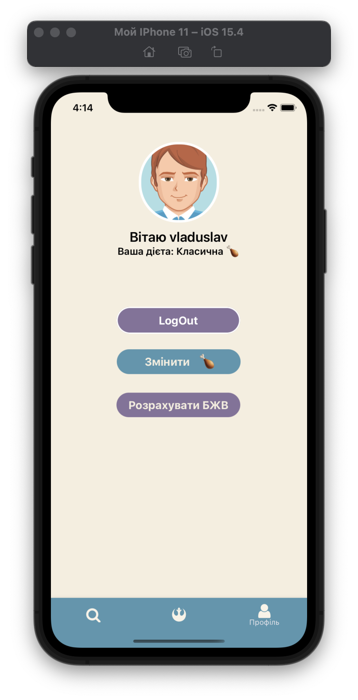 
  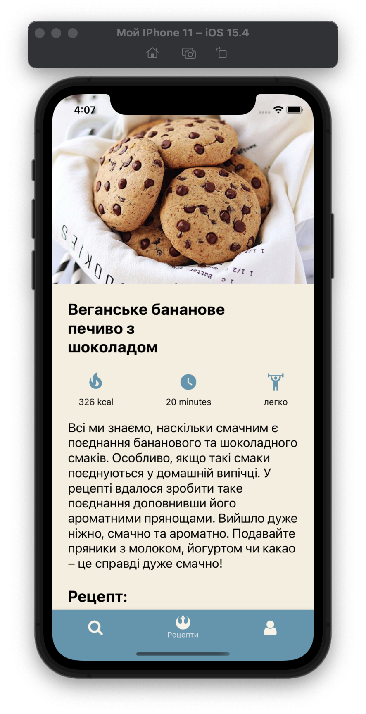
</div>

### Login and registration

<div align="center">
  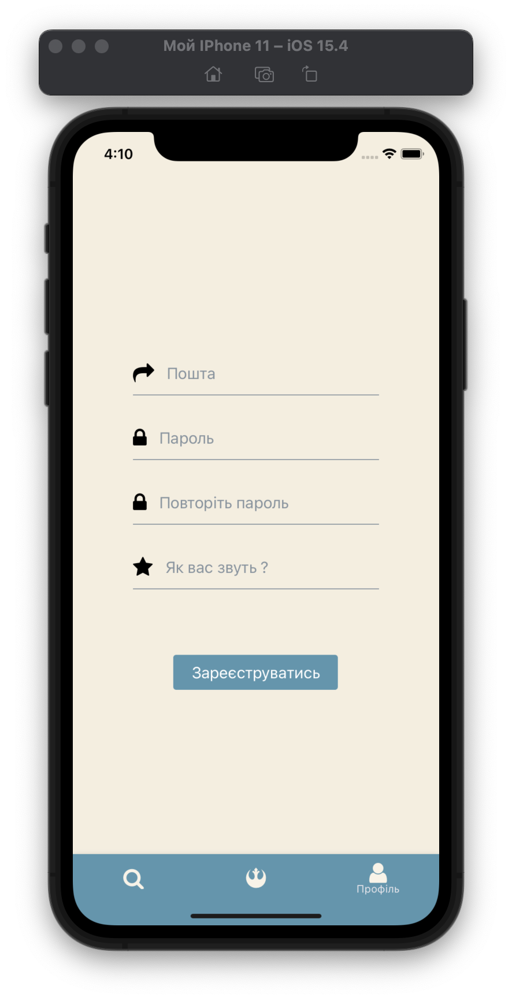 
  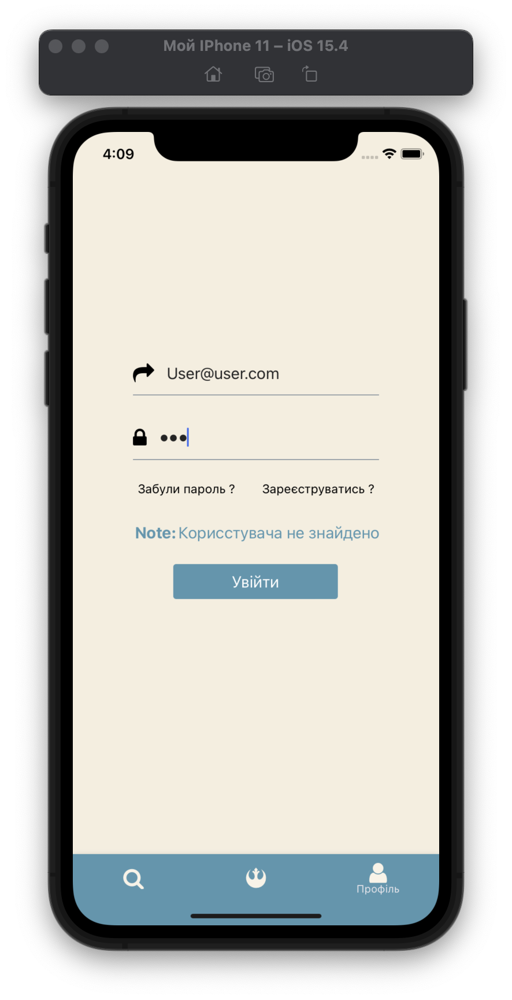
</div>

### Adding data to the database

<div align="center">
  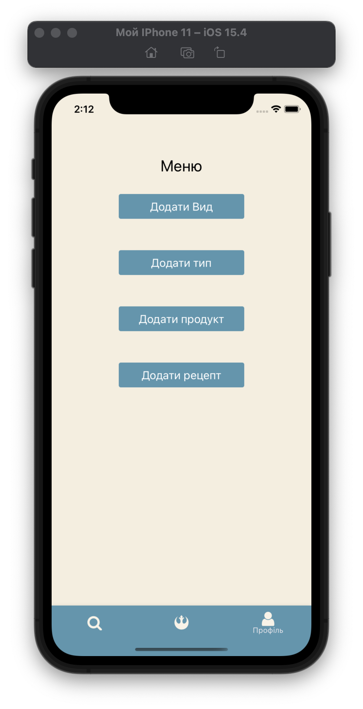 
  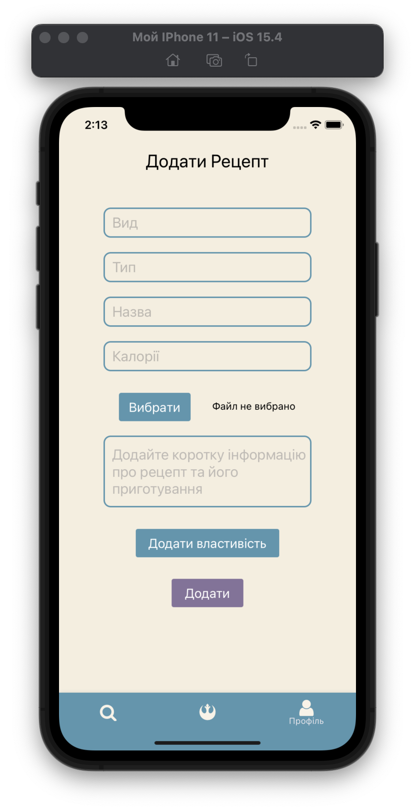
</div>

### Add and view food items for selected dates

<div align="center">
  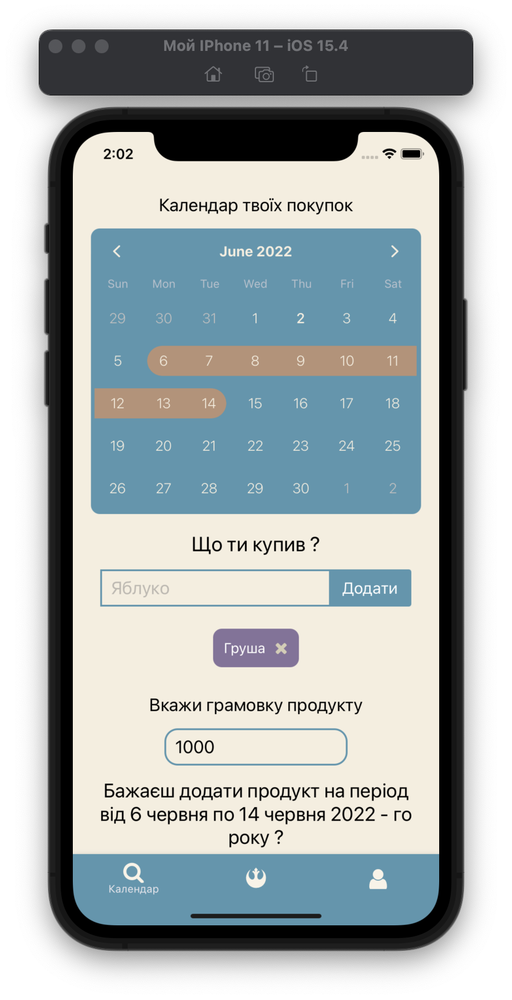 
  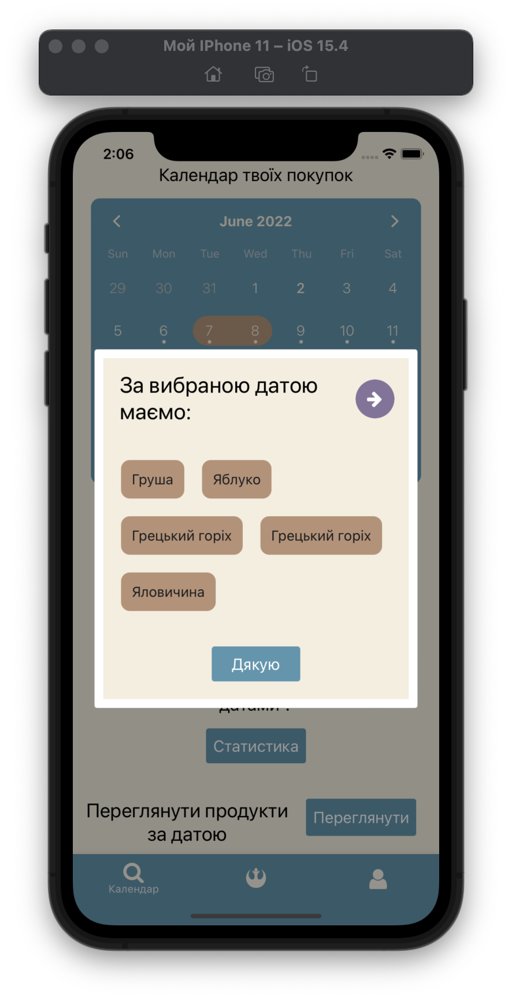
</div>

### Statistics

<div align="center">
  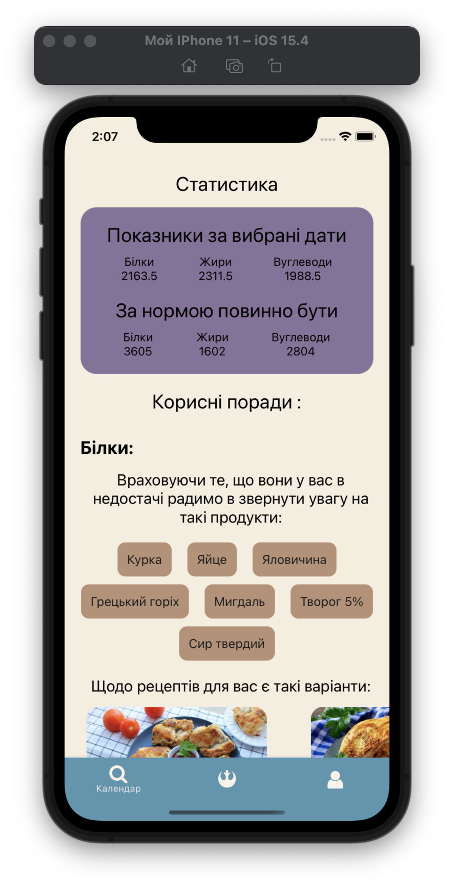 
  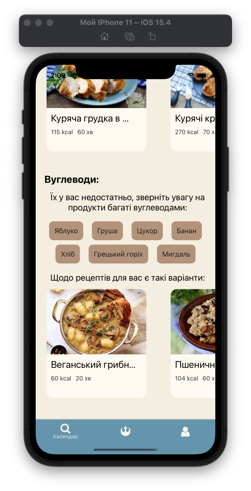
</div>

### A collection of recipes and categories

<div align="center">
  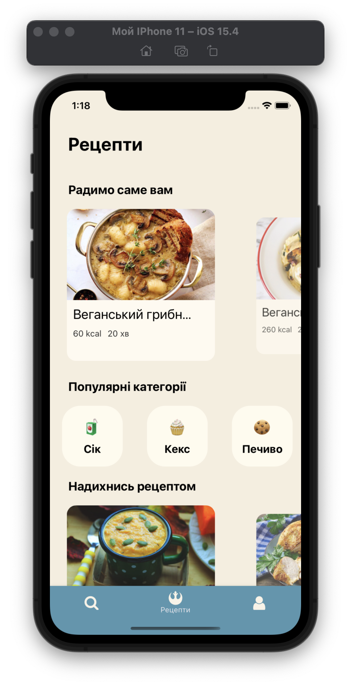 
  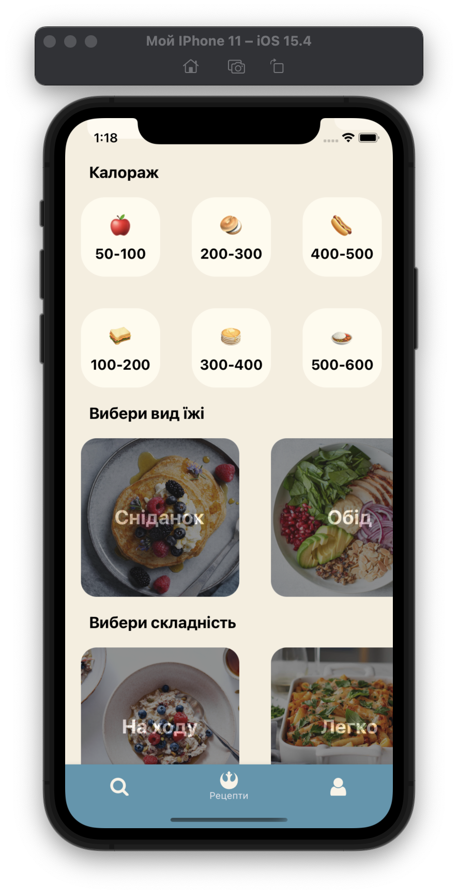
</div>

### Preparation of the dish in detail

<div align="center">
   
</div>
  
</details>

### Built With

* JavaScript
* Node.js
* React-Native
* PostgreSQL
* Expo
* Axios
* Express.js
* Docker
* Sequelize

<p align="right">(<a href="#top">back to top</a>)</p>

<!-- GETTING STARTED -->
## Getting Started

Step-by-step instructions for launching the application

### Installation

_Start postgresql, install dependencies and run app._

1. Make sure you have Node.js, Docker and Git installed!
2. Clone the repo
   ```sh
   git clone https://github.com/1Mayuko1/Buyel.git
   ```
3. Install NPM packages for server and client sides:
   ```sh
   $ cd client # server
   $ npm install
   ```
4. Run database
   ```sh
   $ cd db-deploy
   $ make run
   ```
5. Start server
   ```sh
   $ cd server
   $ npm run dev
   ```
6. Start client
   ```sh
   $ cd client
   $ npm start
   ```
<p align="right">(<a href="#top">back to top</a>)</p>

<!-- CONTACT -->
## Contact

Vladyslav - @importhad(telegram) - vladkond461@gmail.com

Project Link: [https://github.com/1Mayuko1/Buyel](https://github.com/1Mayuko1/Buyel)

<p align="right">(<a href="#top">back to top</a>)</p>

## License
[MIT](https://choosealicense.com/licenses/mit/)

<p align="right">(<a href="#top">back to top</a>)</p>

